<!--
  ✦ GitHub Profile README for @alpana02  ·  Galaxy theme (AI + Data Engineering)
  ✦ Put this file in a PUBLIC repo named exactly "alpana02" so it renders on your profile.
  ✦ Galaxy visuals: local animated SVGs in ./assets — regenerate with:  python3 generate.py
  ✦ Tech logos: local SVGs in ./assets/logos
-->

 

  

<!-- ░░░ TECH STACK · just logos ░░░ -->
&nbsp;&nbsp;
&nbsp;&nbsp;
&nbsp;&nbsp;
&nbsp;&nbsp;
&nbsp;&nbsp;
&nbsp;&nbsp;
&nbsp;&nbsp;
&nbsp;&nbsp;
&nbsp;&nbsp;
&nbsp;&nbsp;
&nbsp;&nbsp;
&nbsp;&nbsp;
&nbsp;&nbsp;
&nbsp;&nbsp;
&nbsp;&nbsp;
&nbsp;&nbsp;
&nbsp;&nbsp;
&nbsp;&nbsp;

---

  

<i>“Be curious. Read widely. Try new things. What people call intelligence just boils down to curiosity.”</i>
 
<b>— Aaron Swartz</b>

